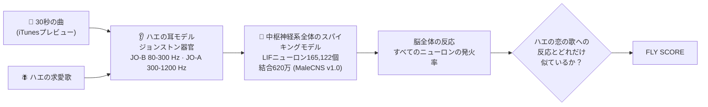

<p align="center"><a href="README.md">English</a> · <a href="README.ko.md">한국어</a> · <b>日本語</b></p>

<h1 align="center">🪰 FLYBOARD</h1>
<p align="center"><b>ショウジョウバエの脳が投票した音楽チャート。</b><br>
84曲 · シミュレーションしたニューロン165,122個 · シナプス9,000万 · 人間の意見 0件</p>

<p align="center">
  <a href="https://sukoji.github.io/flyboard/viewer.html"></a><br>
  <sub><b>左</b> 脳が描いたジャケット · <b>中央</b> ハエの神経系全体を3Dで表示、点ひとつがニューロンひとつで、発火すると光ります ·
  <b>右</b> シミュレーションされた運動ニューロンが動かすハエの体（ヘッドホンは飾りです）。<br>
  <a href="docs/flyboard_countdown.mp4">🔊 フル動画</a>（BGM：合成したショウジョウバエの求愛歌）</sub>
</p>

<p align="center">
  <a href="https://sukoji.github.io/flyboard/viewer.html"><b>🧠 3Dビューアを開く</b></a> — 神経系全体を回転させ、84曲から選んで実際のスパイクを再生できます
  &nbsp;·&nbsp; <a href="https://sukoji.github.io/flyboard/"><b>📊 インタラクティブチャート</b></a>
</p>

2026年9月3日、Google ResearchとHHMI Janeliaが、オスのショウジョウバエの中枢神経系の完全な配線図
（[MaleCNS v1.0](https://male-cns.janelia.org/)、*Cell* 2026）を公開しました。目と触角から脚の運動ニューロンまで、
すべてのニューロンとすべてのシナプスが含まれています。

そこで、そのすべてをスパイキングシミュレーションにつなぎ、耳に音楽を流して、ただひとつの大事な質問をしました。

> **ハエにとって、いちばん「恋」に聞こえる曲はどれ？**

**結果：** 人間の曲はどれも **23.4 / 100点** を超えませんでした。メトロノームは **83点**、
別のハエの求愛歌は **99.9点**。そしてホイットニー・ヒューストンの *I Will Always Love You* は **−3.7点** と、
ホワイトノイズよりも低い結果に。ハエはあなたを永遠には愛してくれません。

---

## 🏆 今週の1位

| チャート | 1位 | FLY SCORE | 2位 | 最下位 |
|---|---|---|---|---|
| 🟡 **HOT 30** · 世紀の名曲 | **Bohemian Rhapsody** · Queen | **23.4** | Billie Jean · Michael Jackson (21.3) | I Will Always Love You · Whitney Houston (−3.7) |
| 🔴 **JAPAN** · J-POP | **プラスティック・ラブ** · 竹内まりや | **22.1** | Subtitle · Official髭男dism (20.1) | First Love · 宇多田ヒカル (7.8) |
| 🔵 **KOREA** · K-POP | **Super Shy** · NewJeans | **20.9** | I Know（난 알아요）· ソテジワアイドゥル (20.8) | Tell Me · Wonder Girls (6.9) |

KOREAの上位3曲（Super Shy 20.9、I Know 20.8、Butter 20.6）は互いのばらつきの範囲内なので、事実上の同率1位です。

## 📊 チャート

<details open><summary><b>🟡 FLYBOARD HOT 30 — 世紀の名曲</b></summary>
<p align="center"></p>
</details>

<details><summary><b>🔴 FLYBOARD JAPAN — J-POP</b></summary>
<p align="center"></p>
</details>

<details><summary><b>🔵 FLYBOARD KOREA — K-POP</b></summary>
<p align="center"></p>
</details>

**ジャケット**はハエが描いたものです。点のひとつひとつが実際の位置にある実際のニューロン（上から見た図）で、明るさはその曲で
どれだけ強く発火したか、色は平均的な曲よりも*どれだけ多く*発火したかを表します。外側のリングは30秒間にハエの耳に届いた
音です。著作権のある画像は使っていません。3つのチャートを合わせたALL-TIMEランキングは[ビューア](https://sukoji.github.io/flyboard/viewer.html)で見られます。

## 🧠 ハエの聴き方



1. **耳。** ハエは触角で音を聴きます。音が触角の先の毛（アリスタ）を揺らすと、ジョンストン器官（JO）のニューロン約500個が
   発火します。JO-Bはハエの求愛歌がある低音域を、JO-Aはより高い音域を担当します
   （[Kamikouchi et al. 2009](https://www.nature.com/articles/nature07843)）。音声を8 kHzにリサンプリングし、ハエの
   可聴帯域で音量をそろえ、2つの帯域に分けて発火率に変換します（順応を入れているので、持続音よりリズムが効きます）。
2. **脳。** MaleCNSコネクトームで追跡されたすべてのニューロンを漏れ積分発火（LIF）ニューロンにし、シナプスが5個以上の
   結合をすべてシナプスにします。興奮・抑制の符号は予測された神経伝達物質から決めます。パラメータは
   [Shiu et al. 2024（*Nature*）](https://www.nature.com/articles/s41586-024-07763-9)の全脳モデルに従います。
   8 GBのGPU 1枚で、一度に32曲ずつ動きます。
3. **審査。** 聴いている間の16.5万個のニューロンそれぞれの発火の速さを記録し、そのパターンを *Drosophila melanogaster*
   の求愛歌（約35 ms間隔のパルスソング＋サインソング）が生むパターンと比べます。

## 📏 スコアは客観的？

シミュレーションのハエでできる限りは客観的です。途中で変えたルールも含めて、すべて公開します。

| | |
|---|---|
| **スケール** | `FLY SCORE = 100 × (sim − sim_noise) / (1 − sim_noise)`。`sim` は曲に対する脳全体の反応と、ハエの求愛歌に対する反応のコサイン類似度です（対数発火率、耳のニューロンは除外）。**0 = ホワイトノイズ、100 = ハエの恋の歌とまったく同じ脳の反応。** |
| **繰り返し** | すべての曲を**独立した4回の試聴セッション**（異なるランダム入力スパイク）で聴かせました。チャートは**中央値**の試聴とそのばらつき（中央絶対偏差）を表示します。基準の反応は、ハエの歌を4回聴いたときのニューロンごとの中央値です。 |
| **なぜ中央値か** | 神経索のある運動回路が、試聴中にときどきオンのまま固定されます（[下記](#-ハエの体は何をする)）。これが一度基準の測定に入り込み、平均では数曲が40点以上に水増しされました。それを*見た後で*中央値に変えたので、判断していただけるようここに明記します。セッションごとのスコアは [`results/scores.csv`](results/scores.csv) にあります。 |
| **対照** | 各セッションでホワイトノイズ、440 Hzの純音、メトロノーム、そして*独立に生成した2曲目の*ハエの求愛歌も聴かせます。別のハエの歌はすべてのセッションで **99.9点**、メトロノームは **83.3点**、純音は **−18.5点**。スケールは意図どおりに働いています。 |
| **頑健性** | 独立セッション間の順位相関：Spearman **ρ = 0.87**。シナプスを弱めた設定（w_syn 0.10 mV）でチャート全体をやり直すと **ρ = 0.89**、トップ10のうち7曲が同じ。耳の順応をなくすと **ρ = 0.80**、10曲中5曲。曲ごとの試聴ばらつきの中央値は **±0.34点** です。 |
| **同じ音量** | すべてのクリップをハエの可聴帯域で音量をそろえているので、マスタリングの音圧では勝てません。 |

## 🔬 わかったこと

- **ハエは低音好き。** スコアは、曲のエネルギーのうちハエの*低音域*の耳ニューロン（JO-B、80-300 Hz）に届く割合と
  連動します（**r = 0.86**）。まさにハエの求愛歌がある帯域です。
- **リズムはメロディに勝つ。** ただのメトロノーム（83.3点）が、人類のあらゆる曲に勝ちます。ハエの恋の歌は本質的に
  まばらなクリック音の連続で、メトロノームも同じです。
- **伸びやかなボーカルと弦楽器は沈む。** 最下位3曲、ホイットニー・ヒューストン（−3.7）、ABBAの *Dancing Queen*（4.5）、
  ベートーヴェンの交響曲第5番（4.7）は、84曲の中で低音の割合が*最も小さい*曲です（下位5%）。3つのチャートの1位は上位11%に入ります。
- **びっくり反応。** 危険から跳んで逃げさせる巨大線維（giant fiber）がいちばん強く発火したのは *bad guy*（29 Hz）、
  *プラスティック・ラブ*（28 Hz）、*I Know*（26 Hz）。チャートでは⚡で示しています。
- **K-POPは写真判定。** Super Shy、I Know、Butterが0.3点以内にひしめいています。

<p align="center"></p>

## 🪰 ハエの体は何をする？

コネクトームは運動ニューロンまでつながっていて、MaleCNSには各運動ニューロンがどの体の部位を動かすかが記されています。
なので、シミュレーションはハエが何を*する*かも教えてくれます。30秒の試聴中の、部位ごとの運動ニューロンの平均発火率です（4セッション）。

| 体の部位（運動ニューロン数） | 人間の曲（84曲の平均） | ハエの求愛歌 | ホワイトノイズ |
|---|---|---|---|
| 腹部 (214) | **23 Hz** | 0.15 Hz | 24 Hz |
| 翅 (67) | **13 Hz** | 1.9 Hz | 13 Hz |
| 脚 (381) | 0.1 Hz | 0.15 Hz | 0.16 Hz |
| 口吻 (67) | 0 | 0 | 0 |
| 平均棍 (16) | 0.01 Hz | **0.85 Hz** | 0 |

**人間の音楽にはびくっとし、ハエの歌には耳を傾ける。** 神経索には腹部と飛翔筋を動かす回路があり、オフとオンの2つの状態を
持ちます。人間の曲は **336回中334回**、約3秒以内にこの回路をオンにし（ホワイトノイズ：4回中4回）、その後は約25 Hzで
オンのまま続きます。この単純化したモデルには、それを止める順応の仕組みがないためです。ハエの求愛歌がオンにしたのは
**8回中1回**、それも遅れてからでした。曲ごとの差はほとんどないので、見せるだけでランキングには使っていません。
ハエを歩かせたり、舌を出させたりした曲はひとつもありません。

画面のハエはアニメ風のオスの *D. melanogaster* です（three.jsのトゥーンシェーディング：アリスタ、平均棍、6本の脚、
オス特有の黒っぽい先端をもつしま模様の腹部。目はアニメ風に描いていて、本物のハエの目は赤です）。**物理シミュレーションではなく、あやつり人形**です。各部位は、その部位を
担当する運動ニューロンの記録された活動に合わせて動きます（MaleCNS `subclass` fl/ml/hl, wm, ad, pm, nm, hm；ジャンプは
giant fiber → TTMn）。どの曲でもいちばん強い反応が最大の動きになるようにそろえています。表情も同じチャネルを読みます。
音に合わせて首を振り、**腹部・飛翔回路がオンになると目を細めて汗をかき**、**FLY SCOREが高いとハートの目**になります。
♪は耳に届く音に合わせて、♥はFLY SCOREに合わせて浮かび上がります。ヘッドホンはただのおしゃれです。ハエは触角で聴きます。

## ✅ 検証：シミュレーションのハエは、ちゃんとハエとして動く？

音楽を任せる前に、教科書どおりの回路を動かしてみました。迫ってくる物体を検出するニューロン（LPLC2）が巨大線維（DNp01）を
動かし、巨大線維がジャンプの運動ニューロン（TTMn）を動かします。シミュレーションで巨大線維を止めると、ジャンプの運動出力は
崩れ（84 → 7 Hz、−91%）、並列の経路（DNp04、314 Hz）はそのまま。本物のハエと同じ論理です。

<p align="center"></p>

## ⚠️ これは何ではないか

- **本物のハエの意見ではありません。** 単純化したモデルです。点ニューロン、化学シナプスのみ（本物のハエの聴覚が大きく
  頼る電気シナプスはなし）、神経修飾なし、学習なし、オス1個体。
- **歌は求愛中枢まで届きません。** このモデルでは、聴覚の信号は初期の聴覚中継点（AMMC/WED、aPN1、巨大線維）までは届くものの、
  求愛ニューロン（pC1、pC2l、pIP10）には届きません。つまりFLY SCOREは「初期の聴覚脳がハエの歌を聴いたときのように
  反応する度合い」であって、「ハエがどれだけ興奮したか」ではありません。耳の入力を強めたり背景ノイズを加えたりしましたが、
  信号を埋もれさせずに解決はできませんでした。
- **30秒のプレビュー**で、曲全体ではありません。Appleがプレビューに選んだ部分が結果に影響します。
- **シナプスの強さを調整し直しています**（1シナプスあたり0.275 mVではなく0.125 mV）。MaleCNSのニューロンはFlyWireより
  シナプスが約1.4倍多く、元の値では約2万個のニューロンが飽和します。

## 🛠️ 自分で動かす

Python 3.11、CUDA GPU（8 GBで十分）、PATH上の `ffmpeg`、ディスク約2 GBが必要です。

```bash
pip install -r requirements.txt
python -m flyboard.connectome              # MaleCNS v1.0 をダウンロード (1.2 GB) + 符号付きグラフを作成
python scripts/fetch_previews.py           # チャートの曲をiTunesで探し、30秒プレビューをダウンロード (ローカルのみ)
for s in 1 2 3 4; do python scripts/run_charts.py --tag s$s --seed $s --save-rates; done   # 4セッション、2080で1回約30分
python scripts/run_charts.py --tag v_w010 --seed 5 --w-syn 0.1 --save-rates   # 頑健性の変種 (任意)
python scripts/run_charts.py --tag v_noadapt --seed 6 --adapt 0 --save-rates
python scripts/score.py                    # セッション -> FLY SCORE (中央値)、ばらつき、頑健性
python scripts/make_covers.py              # 脳が描いたジャケット
python scripts/validate_escape.py          # 検証
python scripts/make_figures.py && python scripts/build_site.py
python scripts/export_web.py               # 3Dビューア用のコンパクトなバイナリ (docs/data/)
python scripts/export_replay.py            # ハイライト5曲のスパイクをフレームごとに
python scripts/render_web_video.py         # three.jsのページをヘッドレスChromeでキャプチャしてカウントダウン動画を作成
```

サイトは `docs/` の静的ファイルです（three.jsはCDN）。`python -m http.server -d docs` のあと
`http://localhost:8000/viewer.html` を開いてください。

`charts/*.csv` を編集すれば好きな曲を追加できます。`flyboard/` 以下のコードは小さく読みやすくしてあります。
`sim.py`（GPUの脳）、`ear.py`（音 → 耳）、`readout.py`（どのニューロンを見るか）、`cover.py`（ジャケット）。
ブラウザ側は `docs/js/` にあります。`brain.js`（点群シェーダー）、`fly.js`（ハエ）、`viewer.js`、`video.js`。

## 🙏 クレジット

- コネクトーム：MaleCNS v1.0、Janelia FlyEM / Google Research、"Sexual dimorphism in the complete connectome
  of the *Drosophila* male central nervous system"、*Cell*（2026）。CC-BY 4.0。実行時にダウンロードし、再配布はしていません。
- 脳モデル：Shiu et al.、"A *Drosophila* computational brain model reveals sensorimotor processing"、*Nature*（2024）に準拠。
- 曲の音声：iTunes Search APIの30秒プレビューをローカルでの解析にのみ使用しました。**このリポジトリに音声は含まれて
  いません。** 曲名と計算した数値のみを公開しています。
- パロディのチャートです。Billboardとは無関係で、提携・承認を受けたものではありません。名前についてハエの意見は聞いていません。
- コード：MIT。
