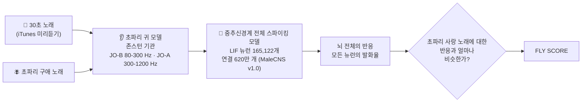

<p align="center"><a href="README.md">English</a> · <b>한국어</b> · <a href="README.ja.md">日本語</a></p>

<h1 align="center">🪰 FLYBOARD</h1>
<p align="center"><b>초파리 뇌가 투표한 음악 차트.</b><br>
노래 84곡 · 시뮬레이션 뉴런 165,122개 · 시냅스 9천만 개 · 참여한 사람 0명</p>

<p align="center">
  <a href="https://sukoji.github.io/flyboard/viewer.html"></a><br>
  <sub><b>왼쪽</b> 뇌가 그린 앨범 커버 · <b>가운데</b> 초파리 신경계 전체를 3D로 표시, 점 하나가 뉴런 하나이고 발화하면 빛납니다 ·
  <b>오른쪽</b> 시뮬레이션된 운동뉴런이 움직이는 초파리의 몸(헤드폰은 장식입니다).<br>
  <a href="docs/flyboard_countdown.mp4">🔊 전체 영상</a> (배경음: 합성한 초파리 구애 노래)</sub>
</p>

<p align="center">
  <a href="https://sukoji.github.io/flyboard/viewer.html"><b>🧠 3D 뷰어 열기</b></a> — 신경계 전체를 돌려 보고, 84곡 중 아무 곡이나 골라 실제 스파이크를 재생해 보세요
  &nbsp;·&nbsp; <a href="https://sukoji.github.io/flyboard/"><b>📊 인터랙티브 차트</b></a>
</p>

2026년 9월 3일, Google Research와 HHMI Janelia가 수컷 초파리 중추신경계의 전체 배선도
([MaleCNS v1.0](https://male-cns.janelia.org/), *Cell* 2026)를 공개했습니다. 눈과 더듬이부터 다리 운동뉴런까지,
모든 뉴런과 모든 시냅스가 담겨 있습니다.

그래서 이것을 통째로 스파이킹 시뮬레이션에 연결하고, 귀에 음악을 꽂은 뒤, 단 하나의 중요한 질문을 던졌습니다.

> **초파리에게 가장 사랑처럼 들리는 노래는 무엇일까?**

**결과:** 사람이 만든 노래는 어느 것도 **23.4 / 100점**을 넘지 못했습니다. 메트로놈은 **83점**,
다른 초파리의 구애 노래는 **99.9점**이었습니다. 그리고 휘트니 휴스턴의 *I Will Always Love You*는 **−3.7점**으로
백색소음보다도 낮았습니다. 초파리는 당신을 영원히 사랑하지 않습니다.

---

## 🏆 이번 주 1위

| 차트 | 1위 | FLY SCORE | 2위 | 꼴찌 |
|---|---|---|---|---|
| 🟡 **HOT 30** · 세기의 명곡 | **Bohemian Rhapsody** · Queen | **23.4** | Billie Jean · Michael Jackson (21.3) | I Will Always Love You · Whitney Houston (−3.7) |
| 🔴 **JAPAN** · J-POP | **プラスティック・ラブ** · 竹内まりや | **22.1** | Subtitle · Official髭男dism (20.1) | First Love · 宇多田ヒカル (7.8) |
| 🔵 **KOREA** · K-POP | **Super Shy** · NewJeans | **20.9** | 난 알아요 · 서태지와 아이들 (20.8) | Tell Me · 원더걸스 (6.9) |

KOREA 차트의 1~3위(Super Shy 20.9, 난 알아요 20.8, Butter 20.6)는 서로의 편차 범위 안에 있어서 사실상 공동 1위입니다.

## 📊 차트

<details open><summary><b>🟡 FLYBOARD HOT 30 — 세기의 명곡</b></summary>
<p align="center"></p>
</details>

<details><summary><b>🔴 FLYBOARD JAPAN — J-POP</b></summary>
<p align="center"></p>
</details>

<details><summary><b>🔵 FLYBOARD KOREA — K-POP</b></summary>
<p align="center"></p>
</details>

**앨범 커버**는 초파리가 그렸습니다. 점 하나하나가 실제 위치에 있는 실제 뉴런(위에서 본 모습)이고, 밝기는 그 곡을 들을 때
얼마나 세게 발화했는지, 색은 평균적인 곡보다 *얼마나 더* 발화했는지를 나타냅니다. 바깥 링은 30초 동안 초파리 귀에 들어간
소리입니다. 저작권 있는 이미지는 쓰지 않았습니다. 세 차트를 합친 ALL-TIME 순위는 [뷰어](https://sukoji.github.io/flyboard/viewer.html)에서 볼 수 있습니다.

## 🧠 초파리가 듣는 방식



1. **귀.** 초파리는 더듬이로 듣습니다. 소리가 더듬이 끝의 털(arista)을 흔들면 존스턴 기관(JO)의 뉴런 약 500개가 발화합니다.
   JO-B 뉴런은 초파리 구애 노래가 있는 저음역을, JO-A는 더 높은 음역을 담당합니다
   ([Kamikouchi et al. 2009](https://www.nature.com/articles/nature07843)). 오디오를 8 kHz로 리샘플링하고, 초파리의
   가청 대역 안에서 음량을 맞춘 뒤, 두 대역으로 나눠 발화율로 바꿉니다(적응 효과를 넣어서 지속음보다 리듬이 중요해집니다).
2. **뇌.** MaleCNS 커넥톰에서 추적된 모든 뉴런을 누설 적분-발화(LIF) 뉴런으로 만들고, 시냅스가 5개 이상인 연결을 모두
   시냅스로 만듭니다. 흥분/억제 부호는 예측된 신경전달물질에서 가져옵니다. 파라미터는
   [Shiu et al. 2024 (*Nature*)](https://www.nature.com/articles/s41586-024-07763-9)의 전뇌 모델을 따릅니다.
   8 GB GPU 한 장에서 한 번에 32곡씩 돌아갑니다.
3. **심사.** 듣는 동안 뉴런 16.5만 개가 각각 얼마나 빨리 발화했는지 기록하고, 그 패턴을 *Drosophila melanogaster*
   구애 노래(약 35 ms 간격의 펄스 노래 + 사인 노래)가 만드는 패턴과 비교합니다.

## 📏 점수는 객관적인가?

시뮬레이션된 초파리로 가능한 만큼은 객관적입니다. 도중에 바꾼 규칙 하나까지 포함해 규칙을 모두 공개합니다.

| | |
|---|---|
| **척도** | `FLY SCORE = 100 × (sim − sim_noise) / (1 − sim_noise)`. `sim`은 노래에 대한 뇌 전체 반응과 초파리 구애 노래에 대한 반응 사이의 코사인 유사도입니다(로그 발화율, 귀 뉴런 제외). **0 = 백색소음, 100 = 초파리 사랑 노래와 똑같은 뇌 반응.** |
| **반복 측정** | 모든 곡을 **독립적인 4번의 청취 세션**(서로 다른 무작위 입력 스파이크)으로 들려줬습니다. 차트는 **중앙값** 청취와 그 편차(중앙값 절대편차)를 보여줍니다. 기준 반응은 초파리 노래를 4번 들었을 때의 뉴런별 중앙값입니다. |
| **왜 중앙값인가** | 신경삭의 한 운동 회로가 청취 도중 가끔 켜진 채로 고정됩니다([아래](#-초파리의-몸은-무엇을-할까)). 이것이 한 번 기준 측정에 끼어들었고, 평균을 쓰면 몇몇 곡이 40점 이상으로 부풀려졌습니다. 이를 *본 뒤에* 중앙값으로 바꿨고, 판단은 여러분께 맡기기 위해 여기에 밝힙니다. 세션별 점수는 [`results/scores.csv`](results/scores.csv)에 있습니다. |
| **대조군** | 각 세션마다 백색소음, 440 Hz 사인음, 메트로놈, 그리고 *독립적으로 생성한 두 번째* 초파리 구애 노래도 함께 들려줍니다. 다른 초파리의 노래는 모든 세션에서 **99.9점**, 메트로놈은 **83.3점**, 사인음은 **−18.5점**입니다. 척도가 제 역할을 합니다. |
| **견고성** | 독립 세션 간 순위 상관: Spearman **ρ = 0.87**. 시냅스를 약하게 한 설정(w_syn 0.10 mV)으로 차트 전체를 다시 돌리면 **ρ = 0.89**, Top 10 중 7곡 유지. 귀 적응 효과를 끄면 **ρ = 0.80**, 10곡 중 5곡 유지. 곡별 청취 편차의 중앙값은 **±0.34점**입니다. |
| **같은 음량** | 모든 클립을 초파리 가청 대역 기준으로 음량을 맞춰서, 마스터링 음량이 크다고 이기지 않습니다. |

## 🔬 발견한 것

- **초파리는 저음을 좋아합니다.** 점수는 곡의 에너지 중 초파리의 *저음역* 귀 뉴런(JO-B, 80-300 Hz)에 닿는 비율과
  함께 움직입니다(**r = 0.86**). 바로 초파리 구애 노래가 있는 대역입니다.
- **리듬이 멜로디를 이깁니다.** 그냥 메트로놈(83.3점)이 인류가 만든 모든 노래를 이깁니다. 초파리 사랑 노래는
  본질적으로 드문드문한 클릭음의 연속이고, 메트로놈도 그렇습니다.
- **길게 끄는 보컬과 현악은 가라앉습니다.** 꼴찌 3곡인 휘트니 휴스턴(−3.7), ABBA의 *Dancing Queen*(4.5),
  베토벤 5번 교향곡(4.7)은 84곡 중 저음 비중이 *가장 낮은* 곡들입니다(하위 5%). 세 차트의 1위 곡은 상위 11% 안에 있습니다.
- **깜짝 놀람.** 위험에서 뛰어 도망치게 하는 거대섬유(giant fiber)가 가장 세게 발화한 곡은 *bad guy*(29 Hz),
  *プラスティック・ラブ*(28 Hz), *난 알아요*(26 Hz)입니다. 차트에 ⚡로 표시했습니다.
- **K-POP은 사진 판정.** Super Shy, 난 알아요, Butter가 0.3점 안에 몰려 있습니다.

<p align="center"></p>

## 🪰 초파리의 몸은 무엇을 할까

커넥톰은 운동뉴런까지 이어져 있고, MaleCNS에는 각 운동뉴런이 어느 신체 부위를 움직이는지 표시돼 있습니다. 그래서
시뮬레이션은 초파리가 무엇을 *할지*도 알려줍니다. 30초 청취 동안 신체 부위별 운동뉴런의 평균 발화율입니다(4세션).

| 신체 부위 (운동뉴런 수) | 사람 노래 (84곡 평균) | 초파리 구애 노래 | 백색소음 |
|---|---|---|---|
| 복부 (214) | **23 Hz** | 0.15 Hz | 24 Hz |
| 날개 (67) | **13 Hz** | 1.9 Hz | 13 Hz |
| 다리 (381) | 0.1 Hz | 0.15 Hz | 0.16 Hz |
| 주둥이 (67) | 0 | 0 | 0 |
| 평형곤 (16) | 0.01 Hz | **0.85 Hz** | 0 |

**사람 음악에는 움찔하고, 초파리 노래에는 귀를 기울입니다.** 신경삭에는 복부와 비행 동력근을 움직이는 회로가 있는데,
꺼짐과 켜짐 두 상태를 가집니다. 사람 노래는 **336번 중 334번** 약 3초 안에 이 회로를 켰고(백색소음: 4번 중 4번),
한번 켜지면 약 25 Hz로 계속 유지됩니다. 이 단순화된 모델에는 다시 끌 적응 기능이 없기 때문입니다. 초파리 구애 노래는
**8번 중 1번**, 그것도 늦게만 켰습니다. 곡끼리는 거의 차이가 없어서 보여주기만 하고 순위에는 쓰지 않았습니다.
초파리를 걷게 하거나 혀를 내밀게 한 곡은 하나도 없습니다.

화면 속 초파리는 만화풍의 수컷 *D. melanogaster*입니다(three.js 툰 셰이딩: 더듬이 털, 평형곤, 다리 6개,
수컷 특유의 짙은 끝을 가진 줄무늬 배. 눈은 만화식으로 그렸고, 실제 초파리 눈은 빨갛습니다). **물리 시뮬레이션이 아니라 꼭두각시**입니다. 각 부위는 그 부위를 담당하는
운동뉴런의 기록된 활동만큼 움직입니다(MaleCNS `subclass` fl/ml/hl, wm, ad, pm, nm, hm; 점프는 giant fiber → TTMn).
어떤 곡이든 가장 강한 반응이 최대 동작이 되도록 맞췄습니다. 표정도 같은 채널을 읽습니다. 소리에 맞춰 고개를 까딱이고,
**복부·비행 회로가 켜지면 눈을 찡그리며 땀을 흘리고**, **FLY SCORE가 높으면 하트 눈**이 됩니다. ♪는 귀에 닿는 소리만큼,
♥는 FLY SCORE만큼 떠오릅니다. 헤드폰은 순전히 멋입니다. 초파리는 더듬이로 듣습니다.

## ✅ 검증: 시뮬레이션된 초파리는 여전히 초파리처럼 동작할까?

음악을 맡기기 전에 교과서적인 회로부터 돌려봤습니다. 다가오는 물체를 감지하는 뉴런(LPLC2)이 거대섬유(DNp01)를 움직이고,
거대섬유가 점프 운동뉴런(TTMn)을 움직입니다. 시뮬레이션에서 거대섬유를 끄면 점프 운동 출력이 무너지고(84 → 7 Hz, −91%),
병렬 경로(DNp04, 314 Hz)는 그대로입니다. 실제 초파리와 같은 논리입니다.

<p align="center"></p>

## ⚠️ 이것이 아닌 것

- **실제 초파리의 의견이 아닙니다.** 단순화된 모델입니다. 점 뉴런, 화학 시냅스만 사용(실제 초파리 청각이 크게 의존하는
  전기 시냅스 없음), 신경조절 없음, 학습 없음, 수컷 한 개체.
- **노래가 구애 중추까지 가지 않습니다.** 이 모델에서 청각 신호는 초기 청각 중계소(AMMC/WED, aPN1, 거대섬유)까지는
  가지만 구애 뉴런(pC1, pC2l, pIP10)에는 닿지 않습니다. 그래서 FLY SCORE는 "초기 청각 뇌가 초파리 노래를 들을 때처럼
  반응하는 정도"이지 "초파리가 얼마나 흥분했는가"가 아닙니다. 귀 입력을 키우거나 배경 잡음을 넣어 봤지만, 신호를
  묻어버리지 않고는 해결되지 않았습니다.
- **30초 미리듣기**이지 곡 전체가 아닙니다. Apple이 미리듣기로 고른 구간이 결과에 영향을 줍니다.
- **시냅스 세기를 다시 맞췄습니다**(시냅스당 0.275 mV 대신 0.125 mV). MaleCNS 뉴런은 FlyWire보다 시냅스가 약 1.4배
  많아서, 원래 값으로는 뉴런 약 2만 개가 포화됩니다.

## 🛠️ 직접 돌려보기

Python 3.11, CUDA GPU(8 GB면 충분), PATH에 `ffmpeg`, 디스크 약 2 GB가 필요합니다.

```bash
pip install -r requirements.txt
python -m flyboard.connectome              # MaleCNS v1.0 다운로드 (1.2 GB) + 부호 있는 그래프 생성
python scripts/fetch_previews.py           # 차트 곡을 iTunes에서 찾아 30초 미리듣기 다운로드 (로컬 전용)
for s in 1 2 3 4; do python scripts/run_charts.py --tag s$s --seed $s --save-rates; done   # 4세션, 2080에서 세션당 약 30분
python scripts/run_charts.py --tag v_w010 --seed 5 --w-syn 0.1 --save-rates   # 견고성 변형 (선택)
python scripts/run_charts.py --tag v_noadapt --seed 6 --adapt 0 --save-rates
python scripts/score.py                    # 세션 -> FLY SCORE (중앙값), 편차, 견고성
python scripts/make_covers.py              # 뇌가 그린 앨범 커버
python scripts/validate_escape.py          # 검증
python scripts/make_figures.py && python scripts/build_site.py
python scripts/export_web.py               # 3D 뷰어용 압축 바이너리 (docs/data/)
python scripts/export_replay.py            # 하이라이트 5곡의 스파이크를 프레임 단위로
python scripts/render_web_video.py         # three.js 페이지를 헤드리스 Chrome으로 캡처해 카운트다운 영상 생성
```

사이트는 `docs/`의 정적 파일입니다(three.js는 CDN). `python -m http.server -d docs` 후
`http://localhost:8000/viewer.html`을 여세요.

`charts/*.csv`를 고치면 원하는 곡을 추가할 수 있습니다. `flyboard/` 아래 코드는 작고 읽기 쉽습니다.
`sim.py`(GPU 뇌), `ear.py`(소리 → 귀), `readout.py`(어떤 뉴런을 보는지), `cover.py`(앨범 아트).
브라우저 쪽은 `docs/js/`에 있습니다. `brain.js`(점 구름 셰이더), `fly.js`(초파리), `viewer.js`, `video.js`.

## 🙏 크레딧

- 커넥톰: MaleCNS v1.0, Janelia FlyEM / Google Research, "Sexual dimorphism in the complete connectome
  of the *Drosophila* male central nervous system", *Cell* (2026). CC-BY 4.0. 실행 시 다운로드하며 재배포하지 않습니다.
- 뇌 모델: Shiu et al., "A *Drosophila* computational brain model reveals sensorimotor processing", *Nature* (2024)를 따랐습니다.
- 곡 오디오: iTunes Search API의 30초 미리듣기를 로컬 분석에만 사용했습니다. **이 저장소에는 오디오가 포함되지
  않습니다.** 곡명과 계산된 수치만 공개합니다.
- 패러디 차트입니다. Billboard와 무관하며 제휴·승인 관계가 없습니다. 이름에 대해 초파리의 의견은 묻지 않았습니다.
- 코드: MIT.
