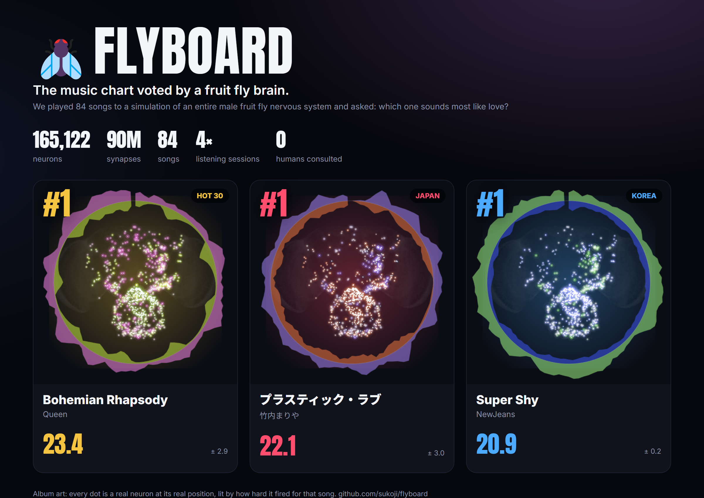
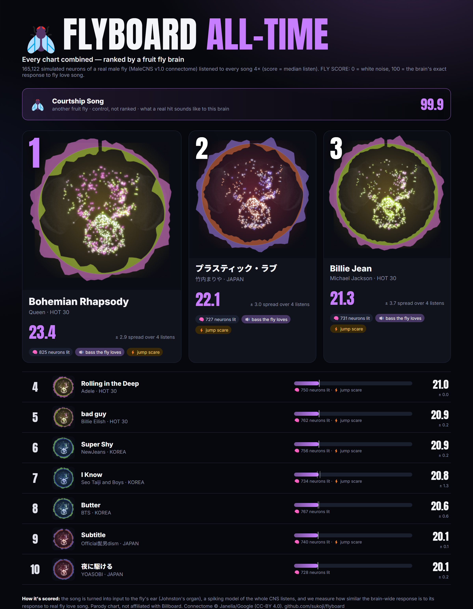
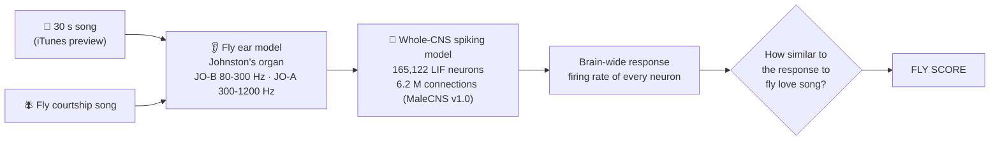

<p align="center">
  
</p>

<h1 align="center">🪰 FLYBOARD</h1>
<p align="center"><b>The music chart voted by a fruit fly brain.</b><br>
84 songs · 165,122 simulated neurons · 90 million synapses · 0 humans consulted</p>

<p align="center">
  <br>
  <sub>🔊 Full video with sound (a real fruit-fly love song): <a href="docs/flyboard_countdown.mp4">flyboard_countdown.mp4</a></sub>
</p>

On September 3, 2026, Google Research and HHMI Janelia published the complete wiring diagram of a male fruit fly's
central nervous system ([MaleCNS v1.0](https://male-cns.janelia.org/), *Cell* 2026): every neuron and every synapse
from the eyes and antennae down to the leg motor neurons.

So we wired all of it into a spiking simulation, plugged music into its ears, and asked the only question that matters:

> **Which song sounds most like love to a fly?**

**The verdict:** no human song scored above **23.4 / 100**. A metronome scored **83**. Another fly's love song scored
**99.9**. And Whitney Houston's *I Will Always Love You* scored **−3.7**, lower than white noise.
The fly does not, in fact, always love you.

---

## 🏆 This week's #1s

| Chart | #1 | FLY SCORE | Runner-up | Last place |
|---|---|---|---|---|
| 🟡 **HOT 30** · Songs of the Century | **Bohemian Rhapsody** · Queen | **23.4** | Billie Jean · Michael Jackson (21.3) | I Will Always Love You · Whitney Houston (−3.7) |
| 🔴 **JAPAN** · J-POP | **プラスティック・ラブ** · 竹内まりや | **22.1** | Subtitle · Official髭男dism (20.1) | First Love · 宇多田ヒカル (7.8) |
| 🔵 **KOREA** · K-POP | **Super Shy** · NewJeans | **20.9** | I Know (난 알아요) · Seo Taiji and Boys (20.8) | Tell Me · Wonder Girls (6.9) |

KOREA's top three (Super Shy 20.9, I Know 20.8, Butter 20.6) are within each other's spread: call it a three-way tie.

## 📊 The charts

<p align="center"></p>

<details open><summary><b>🟡 FLYBOARD HOT 30 — Songs of the Century</b></summary>
<p align="center"></p>
</details>

<details><summary><b>🔴 FLYBOARD JAPAN — J-POP</b></summary>
<p align="center"></p>
</details>

<details><summary><b>🔵 FLYBOARD KOREA — K-POP</b></summary>
<p align="center"></p>
</details>

**Album art:** every cover is painted by the fly. Each dot is a real neuron at its real position in the nervous system
(top view: optic lobes left and right, central brain in the middle, ventral nerve cord at the bottom). Brightness is how
hard it fired during the song, colour is how much *more* it fired for this song than for the average song. No
copyrighted artwork was harmed.

## 🧠 How the fly listens



1. **Ear.** A fly hears with its antennae. Sound vibrates the arista and ~500 Johnston's organ (JO) neurons fire.
   JO-B neurons carry the low frequencies where fly courtship song lives, JO-A the higher ones
   ([Kamikouchi et al. 2009](https://www.nature.com/articles/nature07843)). Audio is resampled to 8 kHz,
   loudness-matched inside the fly's hearing band, split into those two bands, and turned into firing rates
   (with adaptation, so rhythm matters more than drone).
2. **Brain.** Every traced neuron of the MaleCNS connectome becomes a leaky integrate-and-fire neuron; every
   connection with ≥ 5 synapses becomes a synapse whose sign comes from the predicted neurotransmitter. Parameters
   follow the whole-brain model of [Shiu et al. 2024 (*Nature*)](https://www.nature.com/articles/s41586-024-07763-9).
   It runs on one 8 GB GPU, 32 songs at a time.
3. **Judge.** We record how fast each of the 165k neurons fired while listening and compare that pattern to the
   pattern evoked by *Drosophila melanogaster* courtship song (pulse song at ~35 ms intervals + sine song).

## 📏 Is the score objective?

As objective as a simulated fly can be. Here are the rules, including the one we changed along the way:

| | |
|---|---|
| **Scale** | `FLY SCORE = 100 × (sim − sim_noise) / (1 − sim_noise)`, where `sim` is the cosine similarity between the brain-wide response to the song and the response to fly courtship song (log firing rates, ear neurons excluded). **0 = white noise, 100 = the exact brain response to fly love song.** |
| **Repetition** | Every song was played to the brain in **4 independent listening sessions** (different random input spikes). The chart shows the **median** listen and its spread (median absolute deviation). The reference is the per-neuron median over 4 listens to fly song. |
| **Why median** | Now and then the model falls into a random self-sustained burst for part of a listen ([`probe_ignition.py`](scripts/probes/probe_ignition.py)). One such burst landed in a reference listen and, with a mean, inflated a few songs to 40+. A median ignores single freak listens. We switched to the median *after* seeing that, and say so here so you can judge; the per-session scores are all in [`results/scores.csv`](results/scores.csv). |
| **Controls** | Each session also plays white noise, a 440 Hz tone, a metronome and a *second, independently generated* fly courtship song. Another fly's song scores **99.9** in every session, the metronome **83.3**, the tone **−18.5**. The scale does what it says. |
| **Robustness** | Rank correlation between independent sessions: Spearman **ρ = 0.87**. Re-running the whole chart with weaker synapses (w_syn 0.10 mV): **ρ = 0.89**, 7 of the top 10 unchanged. Without ear adaptation: **ρ = 0.80**, 5 of 10. Median spread of a song across listens: **±0.34** points. |
| **Same volume** | Every clip is loudness-normalized in the fly's hearing band, so mastering loudness does not win. |

## 🔬 What we found

- **The fly likes bass.** The score tracks how much of a song's energy reaches the fly's *low-frequency* ear neurons
  (JO-B, 80-300 Hz): **r = 0.86**. That is where fly courtship song lives.
- **Rhythm beats melody.** A bare metronome (83.3) beats every song ever written. Fly love song is essentially sparse
  trains of clicks, and so is a metronome.
- **Big sustained vocals and strings sink.** The bottom three, Whitney Houston (−3.7), ABBA's *Dancing Queen* (4.5) and
  Beethoven's 5th (4.7), have the *smallest* low-frequency share of all 84 songs (bottom 5 %). The #1s of the three
  charts sit in the top 11 %.
- **Jump scares.** The giant fiber, the neuron that makes a fly jump away from danger, fired hardest for
  *bad guy* (29 Hz), *プラスティック・ラブ* (28 Hz) and *I Know* (26 Hz). Marked ⚡ in the charts.
- **K-POP is a photo finish.** Super Shy, I Know and Butter are within 0.3 points.

<p align="center"></p>

## ✅ Sanity check: does the simulated fly still work like a fly?

Before trusting it with music we ran a textbook circuit. Looming detectors (LPLC2) drive the giant fiber (DNp01), which
drives the jump motor neuron (TTMn). Silence the giant fiber in the simulation and the jump motor output collapses
(84 → 7 Hz, −91 %), while a parallel looming pathway (DNp04, 314 Hz) is untouched, the same logic as the real fly.

<p align="center"></p>

## ⚠️ What this is not

- **Not a real fly's opinion.** It is a simplified model: point neurons, chemical synapses only (no gap junctions,
  which the real fly's hearing leans on), no neuromodulation, no learning, one male individual.
- **The song never reaches the courtship centres.** In this model auditory activity gets through the first auditory
  relays (AMMC/WED, aPN1, the giant fiber) but not to the courtship neurons (pC1, pC2l, pIP10). So the FLY SCORE is
  "how much the early auditory brain responds like it does to fly song", not "how aroused the fly got". We tried
  louder ears and background noise; neither fixed it without drowning the signal.
- **What it mostly rewards** is low-frequency, pulsed energy in the 80-300 Hz band. That is an honest finding about
  fly hearing, not a statement about music.
- **30-second previews**, not full songs; the part of the song Apple chose to preview matters.
- **Synaptic strength was re-tuned** (0.125 mV instead of 0.275 mV per synapse) because MaleCNS neurons carry ~1.4× more
  synapses than FlyWire's; with the original value ~20k neurons saturate.

## 🛠️ Run it yourself

Needs Python 3.11, a CUDA GPU (8 GB is plenty), `ffmpeg` on PATH and ~2 GB of disk.

```bash
pip install -r requirements.txt
python -m flyboard.connectome              # download MaleCNS v1.0 (1.2 GB) + build the signed graph
python scripts/fetch_previews.py           # find each chart song on iTunes, download 30 s previews (local only)
for s in 1 2 3 4; do python scripts/run_charts.py --tag s$s --seed $s --save-rates; done   # 4 sessions, ~30 min each on a 2080
python scripts/run_charts.py --tag v_w010 --seed 5 --w-syn 0.1 --save-rates   # robustness variants (optional)
python scripts/run_charts.py --tag v_noadapt --seed 6 --adapt 0 --save-rates
python scripts/score.py                    # sessions -> FLY SCORE (median), spread, robustness
python scripts/make_covers.py              # brain-painted album covers
python scripts/validate_escape.py          # sanity check
python scripts/make_figures.py && python scripts/build_site.py && python scripts/make_countdown.py
```

Add your own songs by editing `charts/*.csv`. Everything under `flyboard/` is small and readable:
`sim.py` (the GPU brain), `ear.py` (sound → ear), `readout.py` (which neurons we look at), `cover.py` (album art).

## 🙏 Credits

- Connectome: MaleCNS v1.0, Janelia FlyEM / Google Research, "Sexual dimorphism in the complete connectome
  of the *Drosophila* male central nervous system", *Cell* (2026). CC-BY 4.0. Downloaded at runtime, not redistributed.
- Brain model after Shiu et al., "A *Drosophila* computational brain model reveals sensorimotor processing", *Nature* (2024).
- Song audio: 30-second previews from the iTunes Search API, used locally for analysis only. **No audio is included in
  this repository**; only song titles and derived numbers are published.
- Parody chart. Not affiliated with, endorsed by, or connected to Billboard. The fly was not consulted about the name.
- Code: MIT.

---

<details><summary><b>🇰🇷 한국어 요약</b></summary>

2026년 9월 공개된 수컷 초파리 중추신경계 전체 커넥톰(뉴런 165,122개)을 GPU 스파이킹 모델로 돌리고, 초파리 귀(존스턴 기관)
모델에 노래를 들려줬습니다. 뇌 전체의 반응이 **초파리 구애 노래를 들을 때와 얼마나 닮았는지**로 점수를 매겨
세기의 명곡(HOT 30), J-POP(JAPAN), K-POP(KOREA) 차트를 만들었습니다. 0점 = 백색소음, 100점 = 초파리 사랑 노래와 같은 뇌 반응.
각 곡을 4번 독립적으로 들려 중앙값과 편차를 냈고, 모델 설정을 바꿔도 순위가 유지되는지 확인했습니다.
앨범 커버는 그 곡을 들을 때 실제로 발화한 뉴런들로 그렸습니다(저작권 이미지 없음). 음원은 저장소에 포함되지 않습니다.

</details>

<details><summary><b>🇯🇵 日本語まとめ</b></summary>

2026年9月に公開されたオスのショウジョウバエ中枢神経系の全コネクトーム（ニューロン165,122個）をGPUでシミュレーションし、
ハエの耳（ジョンストン器官）に曲を聴かせました。脳全体の反応が**ハエの求愛歌を聴いたときにどれだけ似ているか**で採点し、
世紀の名曲・J-POP・K-POPのチャートを作りました。ジャケットは、その曲を聴いたときに実際に発火したニューロンで描いています。

</details>
