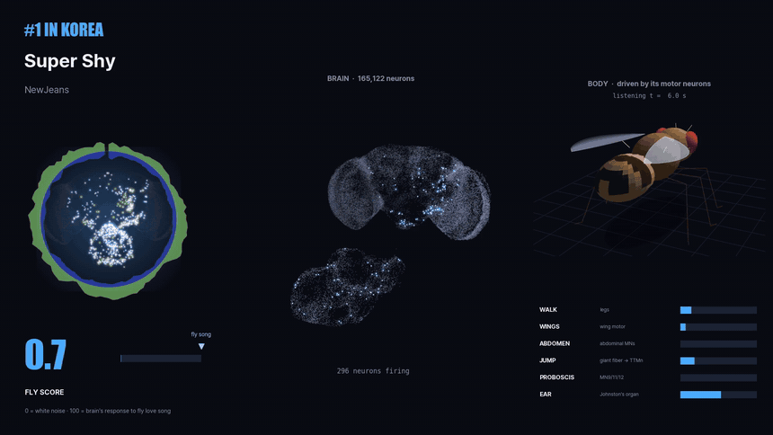
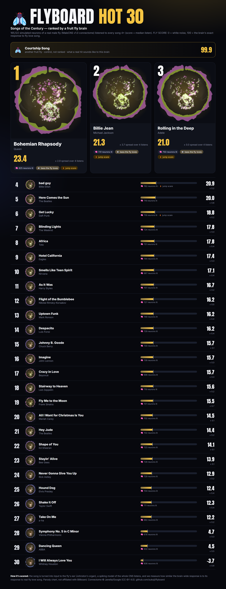
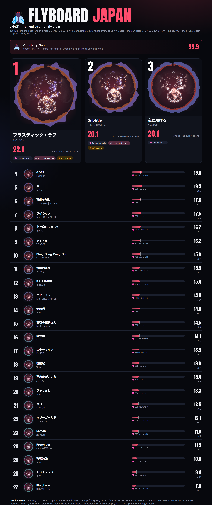
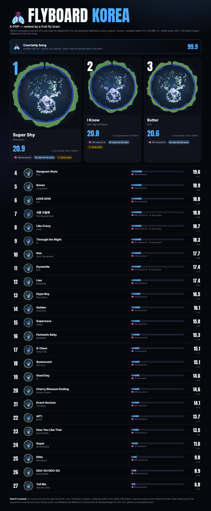
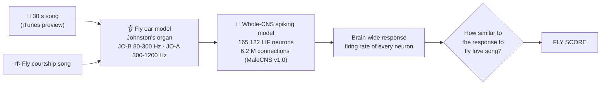
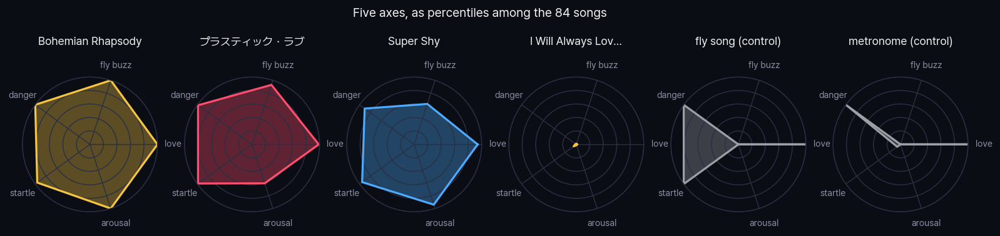
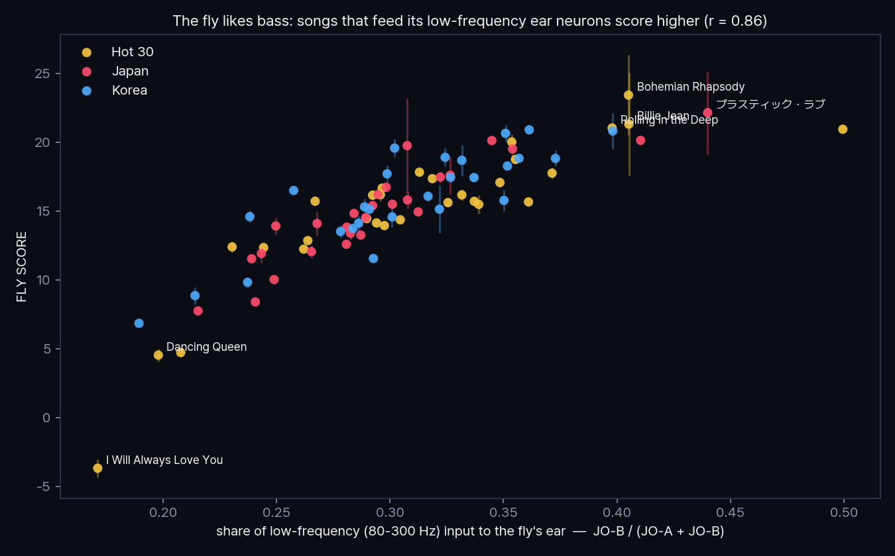
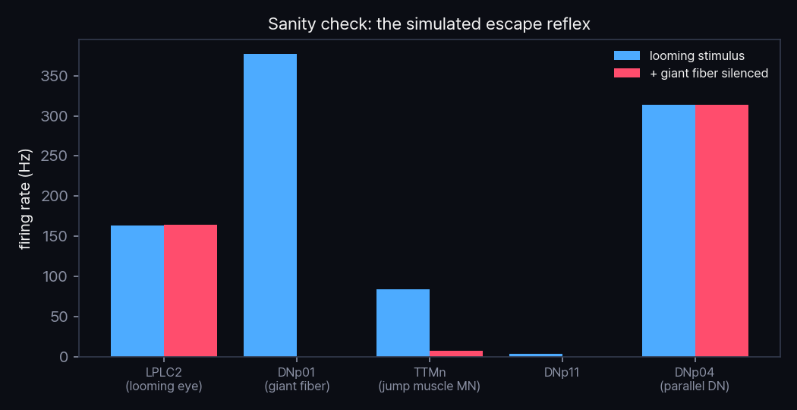

<p align="center"><b>English</b> · <a href="README.ko.md">한국어</a> · <a href="README.ja.md">日本語</a></p>

<h1 align="center">🪰 FLYBOARD</h1>
<p align="center"><b>The music chart voted by a fruit fly brain.</b><br>
84 songs · 165,122 simulated neurons · 90 million synapses · 0 humans consulted</p>

<p align="center">
  <a href="https://sukoji.github.io/flyboard/viewer.html"></a><br>
  <sub><b>Left</b> the song's brain-painted cover · <b>Middle</b> the fly's whole nervous system in 3D, every dot a neuron
  lighting up as it fires · <b>Right</b> the fly's body, moved by its own simulated motor neurons (the headphones are for style).<br>
  <a href="docs/flyboard_countdown.mp4">🔊 full video</a> (soundtrack: a synthetic fruit-fly love song)</sub>
</p>

<p align="center">
  <a href="https://sukoji.github.io/flyboard/viewer.html"><b>🧠 Open the 3D viewer</b></a> — rotate the whole nervous system and its wiring, pick any of the 84 songs and hear it, replay real spikes, switch on command neurons
  &nbsp;·&nbsp; <a href="https://sukoji.github.io/flyboard/"><b>📊 Interactive charts</b></a>
</p>

On September 3, 2026, Google Research and HHMI Janelia published the complete wiring diagram of a male fruit fly's
central nervous system ([MaleCNS v1.0](https://male-cns.janelia.org/), *Cell* 2026): every neuron and every synapse
from the eyes and antennae down to the leg motor neurons.

So we wired all of it into a spiking simulation, plugged music into its ears, and asked the only question that matters:

> **Which song sounds most like love to a fly?**

**The verdict:** no human song scored above **23.4 / 100**. A metronome scored **83**. Another fly's love song scored
**99.9**. And Whitney Houston's *I Will Always Love You* scored **−3.7**, lower than white noise.
The fly does not, in fact, always love you.

---

## 🏆 This week's #1s

| Chart | #1 | FLY SCORE | Runner-up | Last place |
|---|---|---|---|---|
| 🟡 **HOT 30** · Songs of the Century | **Bohemian Rhapsody** · Queen | **23.4** | Billie Jean · Michael Jackson (21.3) | I Will Always Love You · Whitney Houston (−3.7) |
| 🔴 **JAPAN** · J-POP | **プラスティック・ラブ** · 竹内まりや | **22.1** | Subtitle · Official髭男dism (20.1) | First Love · 宇多田ヒカル (7.8) |
| 🔵 **KOREA** · K-POP | **Super Shy** · NewJeans | **20.9** | I Know (난 알아요) · Seo Taiji and Boys (20.8) | Tell Me · Wonder Girls (6.9) |

KOREA's top three (Super Shy 20.9, I Know 20.8, Butter 20.6) are within each other's spread: call it a three-way tie.

## 📊 The charts

<details open><summary><b>🟡 FLYBOARD HOT 30 — Songs of the Century</b></summary>
<p align="center"></p>
</details>

<details><summary><b>🔴 FLYBOARD JAPAN — J-POP</b></summary>
<p align="center"></p>
</details>

<details><summary><b>🔵 FLYBOARD KOREA — K-POP</b></summary>
<p align="center"></p>
</details>

**Album art** is painted by the fly: every dot is a real neuron at its real position (top view), brightness is how hard
it fired for the song, colour how much *more* than for the average song; the ring is the sound reaching its ears over
the 30 s. No copyrighted artwork was harmed. The combined ALL-TIME ranking is in the [viewer](https://sukoji.github.io/flyboard/viewer.html).

## 🧠 How the fly listens



1. **Ear.** A fly hears with its antennae. Sound vibrates the arista and ~500 Johnston's organ (JO) neurons fire.
   JO-B neurons carry the low frequencies where fly courtship song lives, JO-A the higher ones
   ([Kamikouchi et al. 2009](https://www.nature.com/articles/nature07843)). Audio is resampled to 8 kHz,
   loudness-matched inside the fly's hearing band, split into those two bands, and turned into firing rates
   (with adaptation, so rhythm matters more than drone).
2. **Brain.** Every traced neuron of the MaleCNS connectome becomes a leaky integrate-and-fire neuron; every
   connection with ≥ 5 synapses becomes a synapse whose sign comes from the predicted neurotransmitter. Parameters
   follow the whole-brain model of [Shiu et al. 2024 (*Nature*)](https://www.nature.com/articles/s41586-024-07763-9).
   It runs on one 8 GB GPU, 32 songs at a time.
3. **Judge.** We record how fast each of the 165k neurons fired while listening and compare that pattern to the
   pattern evoked by *Drosophila melanogaster* courtship song (pulse song at ~35 ms intervals + sine song).

## 📏 Is the score objective?

As objective as a simulated fly can be. Here are the rules, including the one we changed along the way:

| | |
|---|---|
| **Scale** | `FLY SCORE = 100 × (sim − sim_noise) / (1 − sim_noise)`, where `sim` is the cosine similarity between the brain-wide response to the song and the response to fly courtship song (log firing rates, ear neurons excluded). **0 = white noise, 100 = the exact brain response to fly love song.** |
| **Repetition** | Every song was played to the brain in **4 independent listening sessions** (different random input spikes). The chart shows the **median** listen and its spread (median absolute deviation). The reference is the per-neuron median over 4 listens to fly song. |
| **Why median** | A motor circuit in the nerve cord sometimes latches on during a listen ([below](#-what-the-flys-body-does)). Once it hit a reference listen and, with a mean, inflated a few songs to 40+. We switched to the median *after* seeing that, and say so here so you can judge; per-session scores are in [`results/scores.csv`](results/scores.csv). |
| **Controls** | Each session also plays white noise, a 440 Hz tone, a metronome and a *second, independently generated* fly courtship song. Another fly's song scores **99.9** in every session, the metronome **83.3**, the tone **−18.5**. The scale does what it says. |
| **Robustness** | Rank correlation between independent sessions: Spearman **ρ = 0.87**. Re-running the whole chart with weaker synapses (w_syn 0.10 mV): **ρ = 0.89**, 7 of the top 10 unchanged. Without ear adaptation: **ρ = 0.80**, 5 of 10. Median spread of a song across listens: **±0.34** points. |
| **Same volume** | Every clip is loudness-normalized in the fly's hearing band, so mastering loudness does not win. |

## 🧪 What does the brain add?

Is this just audio matching with extra steps? We scored every song with the same formula on the **ear input alone**
(no brain), using a few summaries of the two ear channels:

| Ear-only score | Rank correlation with FLY SCORE | Same top 10 | Same #1 (of 3 charts) |
|---|---|---|---|
| Loudness balance of the two ear channels (2 numbers) | **ρ = 0.88** | 8 | 1 |
| Low-frequency share (1 number) | ρ = 0.87 | 7 | 1 |
| Rhythm: pulse/beat spectrum, 1-60 Hz | ρ = 0.11 | 0 | 0 |

**Honest reading:** in this model the fly brain mostly hears the *balance between its two ear channels*. Whether a
song's rhythm resembles fly song barely matters: a metronome's rhythm is nothing like fly song, yet it scores 83. The
brain does reshuffle the very top: without it, only 1 of the 3 chart #1s would stay #1.
([scripts/baseline_ear.py](scripts/baseline_ear.py))

## 🎛️ Five axes instead of one

Love is a single reference. We also simulated **another fruit fly flying past** (~220 Hz wingbeat buzz) and **a
wasp-like predator coming at you** (~130 Hz buzz, crescendos), and added two brain readouts:

| Axis | What it measures |
|---|---|
| 💘 love | similarity to the brain's response to fly courtship song (= FLY SCORE) |
| 🪰 fly buzz | similarity to the response to another fly flying past |
| 🐝 danger | similarity to the response to a wasp-like buzz |
| ⚡ startle | giant-fiber (escape neuron) firing |
| 🧠 arousal | how many neurons light up |

<p align="center"></p>

**This fly can barely tell a lover from a wasp.** Love, danger and startle move together (ρ 0.87-0.89): both sounds sit
in the same low band, and this model ignores rhythm. Fly buzz and arousal form a second group (ρ 0.83). So the five
axes really describe two things: low-band balance and how dense the sound is. Every song's radar is in the
[viewer](https://sukoji.github.io/flyboard/viewer.html). ([scripts/score_axes.py](scripts/score_axes.py))

## 🕹️ Command mode: switch on a neuron, watch the fly

Sound is not the only way in. In the viewer's **COMMANDS** tab you switch on a command neuron type, optogenetics-style
(Poisson input for 2 s), and replay the exact spikes of the whole CNS while the fly follows its motor neurons:

| Command | Neurons switched on | Strongest motor output |
|---|---|---|
| 🦘 [Looming shadow](https://sukoji.github.io/flyboard/viewer.html?cmd=jump) | LPLC2 looming detectors (185) → giant fiber | wings 54 Hz, halteres 44 Hz, jump muscle 16 Hz |
| 🎵 [Sing](https://sukoji.github.io/flyboard/viewer.html?cmd=sing) | pIP10 (2) | wings 51 / 47 Hz, nothing else |
| 🧼 [Groom](https://sukoji.github.io/flyboard/viewer.html?cmd=groom) | DNg12 family (42) | neck 52-53 Hz, front legs 25-28 Hz |
| 🔙 [Moonwalk](https://sukoji.github.io/flyboard/viewer.html?cmd=backward) | MDN (4) | neck 39 Hz, middle/hind legs 6-11 Hz |
| 🚶 [P9](https://sukoji.github.io/flyboard/viewer.html?cmd=p9) | DNp09 (2) | neck 72 Hz, abdomen 29 Hz, wings 17-18 Hz |
| 👅 [Proboscis](https://sukoji.github.io/flyboard/viewer.html?cmd=feed) | MN9 (2) | proboscis 7.5 Hz |

Each command lights up the body parts its real counterpart is known for: the song neuron drives only the wings, the
grooming neurons the front legs and the head. The puppet adds a posture hint per command (one wing out for singing,
front legs to the head for grooming, stepping backward for MDN); how much each part moves still comes from the
simulated motor neurons. Steering neurons (DNa01/02) barely moved anything in this model.
([scripts/export_commands.py](scripts/export_commands.py))

## 🔬 What we found

- **The fly likes bass.** The score tracks how much of a song's energy reaches the fly's *low-frequency* ear neurons
  (JO-B, 80-300 Hz): **r = 0.86**. That is where fly courtship song lives.
- **Rhythm beats melody.** A bare metronome (83.3) beats every song ever written. Fly love song is essentially sparse
  trains of clicks, and so is a metronome.
- **Big sustained vocals and strings sink.** The bottom three, Whitney Houston (−3.7), ABBA's *Dancing Queen* (4.5) and
  Beethoven's 5th (4.7), have the *smallest* low-frequency share of all 84 songs (bottom 5 %). The #1s of the three
  charts sit in the top 11 %.
- **Jump scares.** The giant fiber, the neuron that makes a fly jump away from danger, fired hardest for
  *bad guy* (29 Hz), *プラスティック・ラブ* (28 Hz) and *I Know* (26 Hz). Marked ⚡ in the charts.
- **K-POP is a photo finish.** Super Shy, I Know and Butter are within 0.3 points.

<p align="center"></p>

## 🪰 What the fly's body does

The connectome goes all the way down to the motor neurons, and MaleCNS labels which body part each one drives. So the
simulation also tells us what the fly would *do*. Mean firing of each body part's motor neurons over a 30 s listen
(4 sessions):

| Body part (motor neurons) | Human songs (avg of 84) | Fly courtship song | White noise |
|---|---|---|---|
| Abdomen (214) | **23 Hz** | 0.15 Hz | 24 Hz |
| Wings (67) | **13 Hz** | 1.9 Hz | 13 Hz |
| Legs (381) | 0.1 Hz | 0.15 Hz | 0.16 Hz |
| Proboscis (67) | 0 | 0 | 0 |
| Halteres (16) | 0.01 Hz | **0.85 Hz** | 0 |

**Human music makes the fly flinch; fly song makes it listen.** A circuit in the nerve cord that drives the abdomen
and the flight motor has an off and an on state. Human songs switch it on within about 3 seconds in **334 of 336**
listens (white noise: 4 of 4), and it then stays on at ~25 Hz, because this simplified model has no adaptation to
switch it off again. Fly courtship song switched it on in **1 of 8** listens, and only late. It barely differs between
songs, so it is shown but not used for ranking. Nobody gets the fly to walk or to stick its tongue out.

The fly on screen is a cartoon male *D. melanogaster* (three.js, toon-shaded: aristae, halteres, six legs, striped
abdomen with the male's dark tip; the eyes are drawn cartoon-style, a real fly's are red) and a **puppet, not a physics simulation**: each part moves with
the recorded activity of its own motor neurons (MaleCNS `subclass` fl/ml/hl, wm, ad, pm, nm, hm; giant fiber → TTMn for
hops), scaled so the strongest response any song produced is full motion. Its face reads the same channels: it bops to
the sound, **squints and sweats when the abdominal/flight latch switches on**, and gets **heart eyes for a high FLY
SCORE**. ♪ rise with the sound reaching its ears, ♥ with the FLY SCORE. The headphones are pure style: a fly hears
with its antennae.

## ✅ Sanity check: does the simulated fly still work like a fly?

Before trusting it with music we ran a textbook circuit. Looming detectors (LPLC2) drive the giant fiber (DNp01), which
drives the jump motor neuron (TTMn). Silence the giant fiber in the simulation and the jump motor output collapses
(84 → 7 Hz, −91 %), while a parallel looming pathway (DNp04, 314 Hz) is untouched, the same logic as the real fly.

<p align="center"></p>

## ⚠️ What this is not

- **Not a real fly's opinion.** It is a simplified model: point neurons, chemical synapses only (no gap junctions,
  which the real fly's hearing leans on), no neuromodulation, no learning, one male individual.
- **The song never reaches the courtship centres.** In this model auditory activity gets through the first auditory
  relays (AMMC/WED, aPN1, the giant fiber) but not to the courtship neurons (pC1, pC2l, pIP10). So the FLY SCORE is
  "how much the early auditory brain responds like it does to fly song", not "how aroused the fly got". We tried
  louder ears and background noise; neither fixed it without drowning the signal.
- **30-second previews**, not full songs; the part of the song Apple chose to preview matters.
- **Lines in the viewer are straight soma-to-soma links**, not axon paths (real axons wind through the neuropil). A faint
  backbone shows the connectome's 20,000 strongest connections; the bright lines are the strongest connections between
  neurons active for the selected song or command, ranked by synapses × presynaptic firing.
- **Synaptic strength was re-tuned** (0.125 mV instead of 0.275 mV per synapse) because MaleCNS neurons carry ~1.4× more
  synapses than FlyWire's; with the original value ~20k neurons saturate.

## 🛠️ Run it yourself

Needs Python 3.11, a CUDA GPU (8 GB is plenty), `ffmpeg` on PATH and ~2 GB of disk.

```bash
pip install -r requirements.txt
python -m flyboard.connectome              # download MaleCNS v1.0 (1.2 GB) + build the signed graph
python scripts/fetch_previews.py           # find each chart song on iTunes, download 30 s previews (local only)
for s in 1 2 3 4; do python scripts/run_charts.py --tag s$s --seed $s --save-rates; done   # 4 sessions, ~30 min each on a 2080
python scripts/run_charts.py --tag v_w010 --seed 5 --w-syn 0.1 --save-rates   # robustness variants (optional)
python scripts/run_charts.py --tag v_noadapt --seed 6 --adapt 0 --save-rates
python scripts/score.py                    # sessions -> FLY SCORE (median), spread, robustness
python scripts/run_refs.py                 # extra reference sounds (fly buzz, wasp) for the five axes
python scripts/score_axes.py               # five axes
python scripts/baseline_ear.py             # ear-only scores: what the brain adds
python scripts/make_covers.py              # brain-painted album covers
python scripts/validate_escape.py          # sanity check
python scripts/make_figures.py && python scripts/build_site.py
python scripts/export_web.py               # compact binaries for the 3D viewer (docs/data/)
python scripts/export_replay.py            # spikes of the 5 highlighted listens, frame by frame
python scripts/export_commands.py          # command mode: switch on command neurons, record spikes + motor neurons
python scripts/export_wires.py             # connection lines: backbone + active pathway per song / command
python scripts/fetch_preview_urls.py       # Apple preview URLs for the viewer (streamed, not stored) + synthetic control audio
python scripts/render_web_video.py         # countdown video, rendered from the three.js page with headless Chrome
```

The site is plain static files in `docs/` (three.js from a CDN): `python -m http.server -d docs` and open
`http://localhost:8000/viewer.html`.

Add your own songs by editing `charts/*.csv`. Everything under `flyboard/` is small and readable:
`sim.py` (the GPU brain), `ear.py` (sound → ear), `readout.py` (which neurons we look at), `cover.py` (album art).
The browser side is in `docs/js/`: `brain.js` (point-cloud shader), `fly.js` (the fly), `viewer.js`, `video.js`.

## 🙏 Credits

- Connectome: MaleCNS v1.0, Janelia FlyEM / Google Research, "Sexual dimorphism in the complete connectome
  of the *Drosophila* male central nervous system", *Cell* (2026). CC-BY 4.0. Downloaded at runtime, not redistributed.
- Brain model after Shiu et al., "A *Drosophila* computational brain model reveals sensorimotor processing", *Nature* (2024).
- Song audio: 30-second previews from the iTunes Search API, used locally for analysis only. **No audio is included in
  this repository**; only song titles and derived numbers are published. The 3D viewer plays Apple's official previews
  streamed directly from Apple, next to a link to each song on Apple Music; the control sounds are our own synthesis.
- Parody chart. Not affiliated with, endorsed by, or connected to Billboard. The fly was not consulted about the name.
- Code: MIT.
